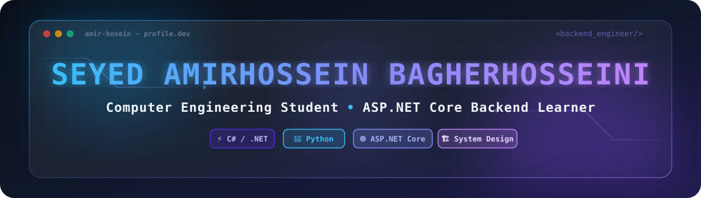

<div align="center">



<br/>

# 👋 Hi, I'm Amir Hossein

[](https://git.io/typing-svg)

<br/>


<br/>

> 🚀 Learning, building, and growing one step at a time.

</div>


---

# 🧑‍💻 About Me

```yaml
name: Amir Hosein

location:
  city: Tehran
  country: Iran

education:
  university: Islamic Azad University
  branch: North Tehran Branch
  major: Computer Engineering - Software

current_status:
  - Computer Engineering Student
  - .NET Bootcamp Student
  - Backend Development Learner

current_focus:
  - C# Programming
  - .NET Ecosystem
  - Backend Fundamentals
  - Software Engineering Concepts

programming_languages:
  - Python
  - C#
  - HTML
  - CSS

interests:
  - Backend Development
  - Software Architecture
  - Clean Code
  - Problem Solving
  - Building Real Projects

goal:
  Become a professional backend developer
  and create reliable software systems.
```

---

# 🧠 Developer Profile

<div align="center">

```text
┌─────────────────────────────────────────────┐
│                                             │
│ 🐍 Python Developer                         │
│ 🔥 C# & .NET Learning Journey               │
│ 🌱 Backend Development Learner              │
│ 🏗 Building Strong Foundations              │
│ 🚀 Turning Ideas Into Projects              │
│                                             │
└─────────────────────────────────────────────┘
```

</div>

---

# 🛠 Tech Stack

<div align="center">


</div>

```text
🐍 Python

• Programming Fundamentals
• Object-Oriented Programming
• Basic Automation
• Problem Solving


🔥 C#

• Currently Learning
• Console Applications
• Object-Oriented Programming
• .NET Fundamentals


🎨 HTML / CSS

• Basic Layouts
• Simple Web Pages
• Calculator Project
• Todo List Project
```

---

# 📚 Learning Roadmap

```text
╔══════════════════════════════════════════════════════╗
║             🚀 BACKEND DEVELOPMENT PATH              ║
╚══════════════════════════════════════════════════════╝


PHASE 01
━━━━━━━━━━━━━━━━━━━━━━━━━━━━━━━━━━━━━━━━━━━━━━━━━━━━━━

🐍 Programming Foundation

✔ Programming Fundamentals
✔ Python Basics
✔ Object-Oriented Programming
✔ Problem Solving


━━━━━━━━━━━━━━━━━━━━━━━━━━━━━━━━━━━━━━━━━━━━━━━━━━━━━━


PHASE 02
━━━━━━━━━━━━━━━━━━━━━━━━━━━━━━━━━━━━━━━━━━━━━━━━━━━━━━

🔥 C# & .NET Fundamentals

Currently Learning:

• C# Syntax
• Console Applications
• Object-Oriented Programming
• Basic .NET Concepts
• LINQ


━━━━━━━━━━━━━━━━━━━━━━━━━━━━━━━━━━━━━━━━━━━━━━━━━━━━━━


PHASE 03
━━━━━━━━━━━━━━━━━━━━━━━━━━━━━━━━━━━━━━━━━━━━━━━━━━━━━━

⚡ Backend Development

Next Steps:

• Web API
• Routing
• Model Binding
• Entity Framework Core
• Identity
• Software Architecture


━━━━━━━━━━━━━━━━━━━━━━━━━━━━━━━━━━━━━━━━━━━━━━━━━━━━━━


PHASE 04
━━━━━━━━━━━━━━━━━━━━━━━━━━━━━━━━━━━━━━━━━━━━━━━━━━━━━━

🚀 Advanced Backend Skills

Future Goals:

• Design Patterns
• SOLID Principles
• Testing
• Security Concepts
• Docker
• Deployment
```

---

# 🎯 Currently Learning

```text
🔥 C#

⚡ .NET Fundamentals

🧩 Object-Oriented Programming

🏗 SOLID Principles

🎨 Design Patterns

🌐 Web API

📦 Entity Framework Core

🔗 LINQ

🏛 Software Architecture

🔐 Security Fundamentals
```

---

# 📖 Course Progress

```text
.NET Backend Bootcamp Journey


✅ Familiarity with Programming Languages

✅ Initial Console Applications

🔄 Basic Concepts of Git & GitHub

🔄 Object-Oriented Programming

🔄 Real World Business Analysis

🔄 SOLID Principles

🔄 Design Patterns

🔄 Basic Concepts of .NET

🔄 Algorithms

🔄 Internet Fundamentals

🔄 LINQ

🔄 Testing Concepts

🔄 Entity Framework Core

🔄 Web API

🔄 Routing

🔄 Model Binding

🔄 Identity

🔄 Docker

🔄 Dapper Concepts

🔄 Software Architecture

🔄 Frontend For Backend Developers

🔄 Security Principles

🔄 Common Vulnerabilities

🔄 AI For Developers

⏳ Final Project

⏳ Resume Writing

⏳ LinkedIn
```

---

# 📊 Skills Overview

```text
🐍 Python

████████░░░░░░░░░░░░ 40%

Level:
Learning / Intermediate Foundation

Knowledge:
• OOP
• Basic Automation
• Programming Logic
• Problem Solving


🔥 C#

Level:
Currently Learning

Focus:
• Syntax
• OOP
• .NET Fundamentals


🎨 HTML / CSS

Level:
Basic

Experience:
• Calculator Project
• Todo List Project
• Simple UI Layouts
```

---

# 🚀 Development Goals

```text
2026 Goals:

✔ Complete .NET Backend Bootcamp

✔ Become Comfortable With C#

✔ Build Backend Projects

✔ Learn ASP.NET Core

✔ Understand Database Fundamentals

✔ Build REST APIs

✔ Improve Software Architecture Skills

✔ Create Professional Portfolio Projects
```

---

# 📫 Connect With Me

<div align="center">

<a href="https://github.com/0xamirhossein" target="_blank">
  
</a>
&nbsp;&nbsp;
<a href="https://linkedin.com/in/seyeyedamirhossein-bagherhosseini" target="_blank">
  
</a>

</div>

---

<div align="center">

### ⭐ Thanks for visiting my profile!

*"Every expert was once a beginner who kept learning."*

<br/>


</div>
